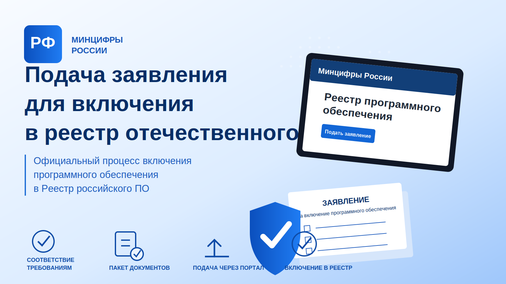

# Skill для подачи ПО в реестр российского ПО



[](https://www.npmjs.com/package/@yasg1988/ru-software-registry-skill)
[](https://github.com/yasg1988/ru-software-registry-skill/releases/tag/v0.1.7)
[](LICENSE)
[](https://github.com/yasg1988/ru-software-registry-skill/actions/workflows/ci.yml)
[](https://github.com/yasg1988/ru-software-registry-skill/actions/workflows/publish-npm.yml)
[](https://github.com/yasg1988/ru-software-registry-skill/actions/workflows/sync-gitverse.yml)
[](skills/ru-software-registry/SKILL.md)
[](https://gitverse.ru/yasg1988/ru-software-registry-skill)

Этот репозиторий содержит skill для Codex, который помогает подготовить проект к подаче в реестр российского ПО Минцифры: проверить готовность продукта, собрать пакет документов, подготовить локальные данные правообладателя и провести заявку через портал до этапа подписи.

## Что делает skill

- Проверяет проект на готовность к подаче: README, лицензия, версии, релизы, публичные репозитории, Docker/npm, инструкции, отсутствие секретов.
- Создает рабочую папку `registry_ru/` внутри проекта и складывает туда документы заявки.
- Генерирует шаблоны документов: описание функционала, инструкция установки, инструкция администратора, инструкция пользователя, жизненный цикл, технические средства хранения и сборки, протокол совместимости, декларации.
- Использует локальный файл с данными правообладателя, чтобы не спрашивать одно и то же каждый раз.
- Ведет заполнение заявки через браузер, но финальную подпись и отправку оставляет пользователю.

## Установка

```powershell
npm install -g @yasg1988/ru-software-registry-skill
install-ru-software-registry-skill
```

После установки skill будет скопирован в:

```text
%USERPROFILE%\.codex\skills\ru-software-registry
```

## Локальные данные правообладателя

В репозитории есть только безопасный шаблон:

```text
data/applicant.example.json
```

Скопируйте его в локальный файл:

```powershell
Copy-Item data\applicant.example.json data\applicant.local.json
```

Файл `data/applicant.local.json` добавлен в `.gitignore` и не должен попадать в публичный репозиторий. В него можно положить ИНН, ОГРН/ОГРНИП, адрес, контакты, сведения о поддержке и хостинге.

## Как пользоваться

Откройте Codex в папке проекта и напишите:

```text
Давай подадим этот продукт в реестр российского ПО.
```

Codex должен включить skill `ru-software-registry`, проверить проект, создать папку `registry_ru/`, подготовить документы и сказать, каких данных не хватает для заявки.

## Важное ограничение

Skill не заменяет юридическую экспертизу и не выполняет юридически значимую отправку без участия пользователя. Подписание КЭП, подтверждение данных и финальная отправка заявки выполняются правообладателем.
